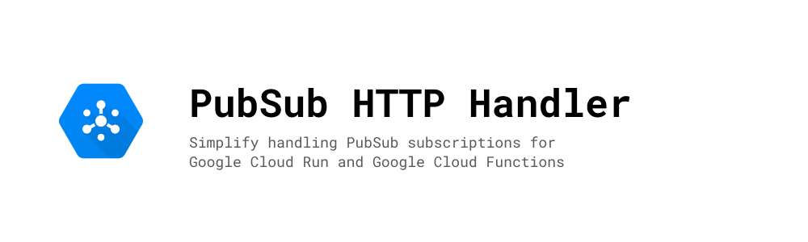

# PubSub HTTP Handler

![Build & Deploy][build-badge] [![Total alerts][lgtm-badge]][lgtm-alerts]
[![LGTM Grade][lgtm-grade]][lgtm-alerts]
[![Maintainability][codeclimate-badge]][codeclimate]



PubSub HTTP Handler is a simple Typescript/Javascript package that solves
serving an HTTP endpoint that can consume PubSub messages. It is intended to use
with Google Cloud Functions or Google Cloud Run.

This package was built so that when creating microservices that subscribes to a
PubSub-topic, we don't have to implement a server or validate the request.

The package utilizes [Fastify][] to serve HTTP.

## Quickstart

```shell
▶ yarn add pubsub-http-handler
```

## Example

```typescript
import { createPubSubServer, PubSubHandler } from 'pubsub-http-handler';

interface MyHandler {
  hello: string;
  world: string;
}

const server = async () => {
  const handler: PubSubHandler<MyHandler> = ({ message, data }) => {
    // `message` contains attributes, data (as string), messageId
    // `data` contains a base64 decoded JSON serialized object (type is MyHandler in the example)
    // ...
  };

  const { listen } = await createPubSubServer(handler);
  await listen();
};
```

We also support `fastify-plugin` and `cloud-functions`. See [more examples in
the `examples/` folder][examples].

Read more about [configuration here][configuration] or check out the [API
documentation][docs]

[examples]: ./examples

## Options

- `onError` (function, default is undefined). Use to ensure that the function
  doesn't throw. **Warning:** Using this option will make the function return
  `204` regardless.

- `parseJson` (boolean, default is `true`). When set to true, uses `JSON.parse`
  to parse the data sent through PubSub.

- `parser` (function, optional). This option can be used to parse data coming
  from PubSub. The function must return data (this data is passed to the
  handler, as `data`). You can optionally throw an exception if the data could
  not be parsed, which in turn can be caught by `onError` if you'd like.

We export a function called `makePubSubConfig` to help with type inference. This
is basicly a function that lets you return a function while using `parser`,
which is returned in `handler`. If you know a way for the types to work without
using a function like this, we would love a pull request!

## Contributing

We love contributions! 🙏 Bug reports and pull requests are welcome on [GitHub].

[banner]: ./assets/banner.jpg
[npm]: https://www.npmjs.com/package/pubsub-http-handler
[build-badge]:
  https://img.shields.io/github/workflow/status/cobraz/pubsub-http-handler/Release?style=flat-square
[codeclimate-badge]:
  https://img.shields.io/codeclimate/maintainability/cobraz/pubsub-http-handler?style=flat-square
[codeclimate]:
  https://codeclimate.com/github/cobraz/pubsub-http-handler/maintainability
[lgtm-badge]:
  https://img.shields.io/lgtm/alerts/g/cobraz/pubsub-http-handler.svg?logo=lgtm&logoWidth=18?style=flat-square
[lgtm-alerts]: https://lgtm.com/projects/g/cobraz/pubsub-http-handler/alerts/
[lgtm-grade]:
  https://img.shields.io/lgtm/grade/javascript/github/cobraz/pubsub-http-handler?style=flat-square
[semantic-release-badge]:
  https://img.shields.io/badge/%20%20%F0%9F%93%A6%F0%9F%9A%80-semantic--release-e10079.svg?style=flat-square
[fastify]: https://www.fastify.io/
[configuration]: ./docs/interfaces/pubsubconfig.md
[docs]: ./docs/
[github]: https://github.com/cobraz/pubsub-http-handler/issues
